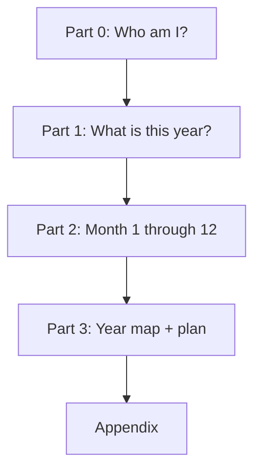

# Annual 12-Month Report — Tier B Product Specification

**Document purpose:** Define the structure, flow, page budget, and user-facing content for the paid **Annual Zi Wei Dou Shu (紫微斗数) Report** — a personalized 12-month forecast grounded in the user's natal chart (本命盘), annual flow (流年), and monthly overlays (流月).

**Tier:** **B (Standard)** — ~44 pages  
**Audience:** Product, design, content, and engineering teams building or delivering this report in NM-ZWDS  
**Related references:**
- [MONTHLY_REPORT_SAMPLE_DATA.md](../../MONTHLY_REPORT_SAMPLE_DATA.md) — sample monthly copy patterns
- [TIMEFRAME_ANALYSIS_OVERVIEW.md](../features/TIMEFRAME_ANALYSIS_OVERVIEW.md) — palace resolution for 流年 / 流月
- [PDF_A4_LAYOUT_AUDIT_PROPOSAL.md](../PDF_A4_LAYOUT_AUDIT_PROPOSAL.md) — A4 print layout guidance

---

## 1. Product Summary

### What the user is buying

A **personalized annual guide** that answers:

1. Who am I in this system? (natal snapshot)
2. What is this year about? (流年 story and priorities)
3. How does each month play out? (12 operational monthly chapters)
4. How does the full year fit together? (year map and action plan)

This is **not** a generic horoscope. Every section must be derived from the user's chart: natal positions, annual palace activations, monthly 四化, and relevant star combinations.

### What the user expects after purchase

| Expectation | How the report delivers |
|-------------|-------------------------|
| **Personalized** | Uses their birth data, gender, and resolved 流年 / 流月 palaces |
| **Actionable** | Clear Do / Avoid / Timing guidance per month |
| **Balanced** | Opportunities and risks in the same voice |
| **Structured** | Same monthly layout across all 12 months for easy comparison |
| **Re-readable** | Works for a first full read and monthly check-ins |
| **Growth-oriented** | "How to become stronger" — not dependency on forecasts |
| **Professional** | ~44 pages, A4-ready, no filler palace essays |

### Delivery format (recommended)

- **Primary:** PDF export (A4 portrait, ~44 pages)
- **Secondary:** In-app scroll view with matching section hierarchy and anchor navigation
- **Optional add-on (not counted in page budget):** Interactive 流月 chart view per month in the app

---

## 2. Tier B Page Budget

| Part | Pages | Running Total |
|------|-------|---------------|
| Part 0 — Opening & Chart Snapshot | 3 | 3 |
| Part 1 — Annual Story & Domain Guide | 6 | 9 |
| Part 2 — 12 Monthly Chapters (2.5 pp × 12) | 30 | 39 |
| Part 3 — Year Map & Action Plan | 4 | 43 |
| Appendix — One-page reference | 1 | **44** |

**Rule:** If content exceeds budget, trim prose first — never remove monthly Do/Avoid/Timing or the annual domain matrix.

---

## 3. Report Flow (Top to Bottom)

```text
┌──────────────────────────────────────────────────┐
│  PART 0   Opening & Chart Snapshot     (3 pp)   │
├──────────────────────────────────────────────────┤
│  PART 1   Annual Story & Domain Guide    (6 pp)   │
├──────────────────────────────────────────────────┤
│  PART 2   12 Monthly Chapters          (30 pp)  │
├──────────────────────────────────────────────────┤
│  PART 3   Year Map & Action Plan        (4 pp)   │
├──────────────────────────────────────────────────┤
│  APPENDIX One-page reference            (1 pp)   │
└──────────────────────────────────────────────────┘
```



### User reading paths

| Intent | Where to go |
|--------|-------------|
| First full read | Part 0 → 1 → skim all months → 3 |
| Monthly check-in | Open current month → blocks ① and ④ only (~1 page) |
| Big decision (job, move, deal) | Part 1 domain row + that month's ④ and ⑥ |
| Year planning | Part 1.1–1.3 + Part 3 entire section |

---

## 4. Part 0 — Opening & Chart Snapshot (3 pages)

**Purpose:** Establish trust, confirm personalization, and give a compact natal baseline before the year story.

### 0.1 Cover & How to Read (0.5 page)

**Show the user:**

- Report title: e.g. *Your 2026 Destiny Guide*
- User name (if provided)
- Birth date, birth time (or "time unknown" note), gender
- Report period (Gregorian year + 农历 year reference)
- Short "How to use this report" (3–4 bullets):
  - Chart shows tendency, not fixed fate — agency matters
  - Read Part 1 first for the year's storyline
  - Return to the relevant month before major decisions
  - 本命 + 流年 + 流月 are woven together throughout

**Do not show:** Long methodology essay, legal disclaimers beyond one line if required.

### 0.2 Natal Snapshot (1 page)

**Show the user:**

| Field | Example display |
|-------|-----------------|
| 命宫主星 | 紫微、天府 |
| 身宫 | 官禄宫 |
| 五行局 | 水二局 |
| 命主 / 身主 | 贪狼 / 文昌 |
| Core personality (2–3 sentences) | Plain-language summary of life approach and natural strengths |

**Visual (recommended):** Small natal chart thumbnail or simplified 十二宫 diagram with 命宫 highlighted.

### 0.3 Strengths, Blind Spots & Chart Map (1–1.5 pages)

**Show the user:**

- **Top 3 natal strengths** — behaviors to lean on all year
- **Top 3 recurring blind spots** — patterns to guard against
- **十二宫 quick map** — one diagram; palaces labeled; no full star dump

**Tone:** Empowering and specific to their chart — not generic personality copy.

---

## 5. Part 1 — Annual Story & Domain Guide (6 pages)

**Purpose:** Tell the whole-year story once, then give a scannable priority map across life domains. Replaces separate long chapters per domain.

### 1.1 Year Theme & Energy Arc (1 page)

**Show the user:**

- **One-sentence year theme** — e.g. *"A year of outward expansion with internal restructuring."*
- **Energy arc** — how the year opens, builds, tests, and closes (short prose or simple curve graphic)
- **Annual keyword** — one memorable word (e.g. *Build*, *Consolidate*, *Transform*)

### 1.2 Key Palaces & 四化 (1–1.5 pages)

**Show the user:**

- Which **十二宫** are most activated this 流年 and why (2–4 palaces max in detail)
- **流年四化** table:

| 四化 | Lands in (palace) | Meaning for you |
|------|-------------------|-----------------|
| 化禄 | 财帛宫 | … |
| 化权 | 官禄宫 | … |
| 化科 | 夫妻宫 | … |
| 化忌 | 疾厄宫 | … |

- **1–2 critical annual star notes** — only stars that materially change the year

**Visual (recommended):** 流年 overlay mini-chart or highlighted palace cards.

### 1.3 Opportunities & Risks (1 page)

**Show the user:**

| Type | Item | Posture |
|------|------|---------|
| Opportunity 1 | … | How to lean in |
| Opportunity 2 | … | … |
| Opportunity 3 | … | … |
| Risk 1 | … | How to mitigate |
| Risk 2 | … | … |
| Risk 3 | … | … |

**Tone:** Honest but constructive — risks include coping posture, not fear language.

### 1.4 Annual Domain Matrix (2–3 pages)

**Show the user:** One primary table for the full year, plus half a page of notes on the top 2 priority domains.

| Domain | Palace | Year trend | Focus this year | Avoid this year |
|--------|--------|------------|-----------------|-----------------|
| Career 官禄 | … | ↑ / → / ↓ | … | … |
| Wealth 财帛 | … | … | … | … |
| Love 夫妻 | … | … | … | … |
| Health 疾厄 | … | … | … | … |
| Family 田宅 | … | … | … | … |
| Network 交友 | … | … | … | … |
| Inner 福德 | … | … | … | … |
| External 迁移 | … | … | … | … |

**Optional compact ratings row per domain:** Career / Wealth / Love / Health as ★★★★☆ (used sparingly — matrix is primary).

**Notes block (0.5 page):** Expand only the **two highest-priority domains** for the year with 2–3 sentences each.

---

## 6. Part 2 — 12 Monthly Chapters (30 pages total)

**Purpose:** Operational layer — month-by-month execution. Each month is **~2.5 pages** using the **same 6-block template**.

### Month order & labeling

- 12 consecutive months for the purchased report year (e.g. Jan 2026 – Dec 2026)
- Each chapter header: **Month name**, Gregorian range, 农历 month reference
- Optional: seasonal tag (e.g. 🌱 Spring — Expand) when it adds value

### Standard monthly template (repeat × 12)

```text
MONTH [N] — [Month Name] ([Start] – [End])
农历: [Month reference]
════════════════════════════════════════════

① Month Snapshot                    (~¼ page)
② Key Activations                   (~½ page)
③ Life Areas This Month             (~1 page)
④ See · Hear · Do                   (~½ page)
⑤ Grow Stronger                     (~¼ page)
⑥ Timing Note                       (~¼ page)
```

---

### ① Month Snapshot (~¼ page)

**Show the user:**

| Element | Content |
|---------|---------|
| **Theme** | One line — e.g. *"Step into visibility."* |
| **Energy** | Short descriptor: high action / low stability / reflective / social |
| **Month keyword** | Single word for memory |
| **Link to year** | One sentence: how this month supports or challenges the annual theme |
| **Palace focus** | Primary activated palace (e.g. 官禄宫) |
| **Quick ratings (optional)** | Career / Wealth / Love / Health as stars — keep to one row |

**User value:** Glanceable summary for monthly check-in.

---

### ② Key Activations (~½ page)

**Show the user:**

- **Main activated palaces** (2–4) — connection to natal + 流年
- **流月四化** — where 禄权科忌 fly this month and practical effect
- **Critical stars only** — 1–3 主星 or 吉星/煞星 that change the month's tone

**Do not show:** Full star catalog, every auxiliary star, or textbook definitions.

**Visual (recommended):** 流月 palace highlight on chart snippet or palace focus badge.

---

### ③ Life Areas This Month (~1 page)

**Show the user:** Combined reading in **four clusters** (not twelve separate palace essays).

#### Cluster A — Self & Mindset (命宫 / 福德)

- Overall state, confidence, inner pressure or calm
- Lead vs. observe vs. rest this month

#### Cluster B — Work & Money (官禄 / 财帛)

- Career visibility, performance, job/business moves
- Income trend, spending risk, suitable financial posture

#### Cluster C — People & Love (夫妻 / 交友 / 兄弟)

- Partner/singles dynamics, key social patterns
- 贵人 vs. friction; collaboration vs. rivalry

#### Cluster D — Body, Home & World (疾厄 / 田宅 / 父母 / 子女 / 迁移)

- Health watchpoints and stress triggers
- Home/family atmosphere; travel/external opportunities

**Format:** Short paragraphs or tight bullets — scannable on mobile and print.

**Rule:** Only discuss palaces that are **activated or materially relevant** this month. Skip silent palaces.

---

### ④ See · Hear · Do (~½ page)

**Show the user:**

#### SEE — Likely manifestations (2–3 bullets)

What they may notice in real life — people, events, emotional signals, external mirrors of palace activation.

*Example:*
- More meetings and visibility requests at work
- A friend or mentor offers an introduction
- Sleep or digestion needs extra attention mid-month

#### HEAR — Communication guidance (1–2 bullets)

- Favored tone: persuasive / humble / firm / diplomatic
- Risks: gossip, misunderstandings, negotiations to defer

#### DO — Action table

| Must Do (max 2) | Avoid (max 2) | Best timing |
|-----------------|---------------|-------------|
| … | … | Early / Mid / Late month |

**User value:** This block is the highest-priority content for purchased-report satisfaction. Never cut it for page budget.

---

### ⑤ Grow Stronger (~¼ page)

**Show the user:**

- **One character focus** — e.g. patience, boundaries, decisiveness
- **One monthly practice** — repeatable habit (reflection, health routine, mentorship check-in)
- **Optional:** How to turn monthly pressure (化忌 / 煞) into constructive strength — one sentence

**Tone:** Development, not superstition-only remedies.

---

### ⑥ Timing Note (~¼ page)

**Show the user:**

- **Favorable window** — date range for important moves (signing, travel, interviews, key conversations)
- **Caution window** — when to hold steady or avoid major commitments
- Dates in **Gregorian**; optional 农历 in parentheses

**Scope:** Windows, not exhaustive daily almanac — keeps page count honest.

---

## 7. Part 3 — Year Map & Action Plan (4 pages)

**Purpose:** Zoom out after 12 months — connect the year into one picture and leave the user with a plan.

### 3.1 12-Month Overview Map (1 page)

**Show the user:**

One visual table or heatmap:

| Month | Career | Wealth | Love | Health | Keyword |
|-------|--------|--------|------|--------|---------|
| Jan | ★★★★ | ★★★ | ★★ | ★★★★ | Build |
| Feb | … | … | … | … | … |
| … | … | … | … | … | … |

**User value:** Single-page year at a glance — highly shareable and re-readable.

### 3.2 Best & Challenging Months (1 page)

**Show the user:**

| Category | Months | One-line why | Strategy |
|----------|--------|--------------|----------|
| Best for career | … | … | … |
| Best for wealth | … | … | … |
| Best for love | … | … | … |
| Best for health/rest | … | … | … |
| Most challenging | … | … | How to navigate |

**Cap:** Top 2–3 per row — no long essays.

### 3.3 Turning Points & Key Windows (1 page)

**Show the user:**

- **Turning-point months** — where direction, role, or relationships may shift
- **Golden windows** — consolidated best periods for major moves (from monthly ⑥)
- **Caution calendar** — consolidated hold-steady periods

**Format:** Bullet list or compact timeline — not duplicate monthly chapters.

### 3.4 Your Annual Playbook (1–2 pages)

**Show the user:**

| Block | Content |
|-------|---------|
| **3 annual goals** | Aligned with chart strengths + year theme |
| **3 annual guardrails** | Non-negotiables to avoid self-sabotage |
| **12 monthly keywords** | One word per month — memory anchor |
| **Q1 starter plan** | 3–5 concrete actions for the first 90 days |
| **When to re-read** | Short guide: which part to open before job change, negotiation, travel, etc. |

**Closing line:** Empowerment framing — chart as map, user as driver.

---

## 8. Appendix (1 page)

**Purpose:** Reference only — report must stand alone without it.

**Show the user:**

- **Glossary** — 15–20 terms (命宫, 流年, 流月, 四化, 化忌, 贵人, 煞星, etc.) in plain language
- **Chart diagram** — Natal + 流年 on one page (optional 流月 legend note)

**Move outside Tier B PDF (digital supplement):**

- Full star inventory
- Detailed symbolic remedies
- Lengthy methodology / calculation notes

---

## 9. User-Facing Section Checklist (Purchase Value)

Use this checklist to validate that a delivered report meets Tier B expectations.

### Foundation (Part 0–1)

- [ ] Birth data and report year are correct on cover
- [ ] Natal snapshot reflects user's actual 命宫主星 and key chart facts
- [ ] Year theme is one clear sentence, not vague positivity
- [ ] 流年四化 table is present and personalized
- [ ] Annual domain matrix covers all 8 domain rows
- [ ] Opportunities and risks are balanced (3 + 3)

### Monthly chapters (Part 2 × 12)

- [ ] All 12 months present with consistent 6-block structure
- [ ] Each month has Month Snapshot + See/Hear/Do
- [ ] Each month links back to annual theme (one line minimum)
- [ ] Life areas use 4 clusters, not 12 repetitive palace blocks
- [ ] Grow Stronger gives one character focus + one practice
- [ ] Timing Note gives favorable + caution windows
- [ ] No month exceeds ~3 pages; no month below ~2 pages without reason

### Synthesis (Part 3)

- [ ] 12-month overview map is present
- [ ] Best/challenging months identified with strategy
- [ ] Annual playbook: 3 goals, 3 guardrails, 12 keywords, Q1 actions

### Quality

- [ ] Personalized — cannot swap names and pass as another user's report
- [ ] Actionable — user knows what to do next Monday
- [ ] No filler — inactive palaces not padded with generic text
- [ ] Consistent voice — professional, direct, growth-oriented

---

## 10. Content Rules (Generation & Editorial)

### Personalization stack

Every interpretation must trace to:

1. **本命盘** — natal star and palace baseline
2. **流年盘** — annual palace activation and 流年四化
3. **流月盘** — monthly palace shift and 流月四化

See [TIMEFRAME_ANALYSIS_OVERVIEW.md](../features/TIMEFRAME_ANALYSIS_OVERVIEW.md) for how NM-ZWDS resolves physical palaces per timeframe.

### What to cut first (if over page budget)

1. Secondary star explanations
2. Inactive palace commentary
3. Repeated annual context in every month (keep one line only)
4. Long prose in Cluster D (health/home) — tighten to bullets
5. Appendix extras (keep to 1 page)

### What never to cut

1. Monthly **See · Hear · Do**
2. Annual **domain matrix**
3. Part 3 **12-month map** and **playbook**
4. Monthly **link to year theme**

### Voice & language

- Plain language first; technical terms with brief explanation on first use
- Avoid fatalistic phrasing ("you will fail") — use tendency + choice
- Avoid empty flattery — specificity builds trust
- **i18n note:** If localized, 宫位 names should keep 中文 labels with translated gloss where helpful

---

## 11. Display & UX Recommendations (App + PDF)

### PDF (A4)

- Follow [PDF_A4_LAYOUT_AUDIT_PROPOSAL.md](../PDF_A4_LAYOUT_AUDIT_PROPOSAL.md): ~44 pages, intentional page breaks, no orphan headers
- Part 0–1: section heroes with clear part numbers
- Each month: start on new page or clear page-break before ① Snapshot
- Part 3.1 heatmap: landscape table or full-width graphic for readability

### In-app

- Sticky **Part** navigation: 0 | 1 | 2 (Jan–Dec) | 3 | Appendix
- Month list sidebar with **keyword chips** from ① Snapshot
- "Quick read" mode: expand only ① + ④ per month
- Export button: **Download full PDF (44 pages)**

### Above-the-fold per month (web)

1. Month Snapshot (theme, keyword, ratings)
2. Must Do / Avoid (from ④)
3. Expand for clusters, activations, timing

---

## 12. Out of Scope (Tier B)

Not included in the base ~44-page product unless sold as add-on:

| Item | Reason |
|------|--------|
| Daily 流日 guidance | Page budget; different product tier |
| Partner compatibility deep-dive | Separate report |
| Full 十二宫 essay per month | Cut in Tier B — use 4 clusters |
| Exhaustive auspicious hour 择时 | Monthly windows only in ⑥ |
| Long remedy catalogs | Appendix digital supplement |
| Previous-year comparison essay | Optional Tier C or add-on |

---

## 13. Sample Monthly Chapter Outline (Blank)

Use this skeleton when authoring or generating content.

```markdown
## Month [N] — [Month Name]
**Period:** [Start] – [End] | **农历:** [ref] | **Keyword:** [word]

### ① Month Snapshot
- **Theme:**
- **Energy:**
- **Palace focus:**
- **Year link:**
- **Ratings:** Career ★ | Wealth ★ | Love ★ | Health ★

### ② Key Activations
- **Palaces:**
- **流月四化:**
- **Critical stars:**

### ③ Life Areas
**A. Self & Mindset** — …
**B. Work & Money** — …
**C. People & Love** — …
**D. Body, Home & World** — …

### ④ See · Hear · Do
**SEE:** …
**HEAR:** …
| Must Do | Avoid | Best timing |
|---------|-------|-------------|

### ⑤ Grow Stronger
- **Character:**
- **Practice:**

### ⑥ Timing
- **Favorable:**
- **Caution:**
```

For filled examples, see [MONTHLY_REPORT_SAMPLE_DATA.md](../../MONTHLY_REPORT_SAMPLE_DATA.md).

---

## 14. One-Line Summary

> **Tier B (~44 pages) = natal snapshot (3) + annual strategy matrix (6) + twelve consistent monthly playbooks (30) + year map and action plan (4) + minimal glossary (1) — personalized, actionable, and re-readable every month.**

---

## Document history

| Date | Change |
|------|--------|
| 2026-07-02 | Initial Tier B product specification |
