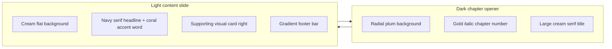
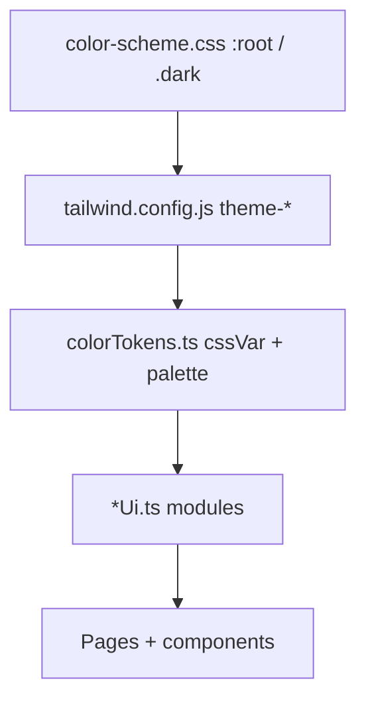

# PPT vs Website UI/UX Design Analysis Report

**Project:** NM-ZWDS (Purple Star Astrology / 紫微斗数)  
**Brand:** CAE GOH  
**Report date:** 2026-06-03  
**Author:** UI/UX design analysis (agent-assisted)  

**Sources analyzed:**

| Source | Location / format | Notes |
|--------|-----------------|-------|
| CAE English PPT | `D:\Downloads\Cae English PPT.pdf` | 65 slides, 1440×810px, Canva export (May 2026) |
| PPT reference stills | `Light.jpeg`, `Dark.jpeg`, footer crop | Chapter opener + content slide patterns |
| Website design system | `src/styles/`, `tailwind.config.js`, `src/index.css` | Token-driven implementation |
| Website screenshots | Dashboard, sign-in, result pages (May 2026) | Current shipped / in-progress UI |
| Existing docs | `docs/color-scheme/COLOR_SCHEME.md` | Palette extracted from Light/Dark designs |

---

## 1. Executive Summary

The **CAE English PowerPoint** and the **NM-ZWDS website** share the same brand DNA—cream backgrounds, navy text, gold accents, and a signature purple-to-orange gradient—but they express that DNA through **different design philosophies**.

| Dimension | PPT slides | Current website |
|-----------|------------|-----------------|
| **Primary philosophy** | Editorial luxury storytelling | Functional analytical dashboard |
| **Information model** | One idea per slide; narrative chapters | Dense cards, tables, charts; tool-first |
| **Typography** | Decorative serif + restrained sans | Inter only; bold uppercase heroes |
| **Gradient usage** | Full-width footer bar (spatial anchor) | Clip-text on brand wordmark and heroes |
| **Whitespace** | 60–70% empty; restraint = premium | Moderate; data density prioritized |
| **Emotional tone** | Authority, exclusivity, “imperial” craft | Utility, clarity, SaaS professionalism |

**Key finding:** Color tokens are largely aligned (`#F6F0E8`, `#1A1E3F`, `#D4AF7B`, `#C84C5C`, gradient stops through `#FE8E01`). The **largest gaps** are typography (no serif on web), spatial branding (no footer gradient bar), chapter-style section labeling, and content density on analysis/result pages versus PPT restraint.

**Recommendation (high level):** Treat the PPT as the **brand expression layer** and the website as the **product layer**. Bridge them by introducing a display serif for page heroes, a site-wide footer matching the PPT gradient strip, chapter-style section headers on long-form reports, and selective whitespace reduction on marketing/auth surfaces—not on data-heavy chart views.

---

## 2. PPT Slide Design — Core Design Philosophy

The deck titled *Copy of Copy of Understanding Business Strategy* (Canva, author Elliot, branded CAE GOH) is a **65-slide English presentation** for Zi Wei Dou Shu and related business/life strategy content. Most slides are image-heavy; text extraction yields sparse literals (e.g. star profiles, “Ju Men (巨门)—The Persuader”, “CAE GOH” footer). Visual analysis relies on confirmed slide stills and PDF metadata.

### 2.1 Editorial Luxury Storytelling

The deck behaves like a **high-end editorial publication** or luxury brand lookbook—not like application UI. Slides are composed for **projection legibility** and **emotional positioning**, not for scanning tables or clicking controls.

### 2.2 Six Design Pillars

#### Pillar 1 — Dual-mode slide architecture

Slides alternate between two distinct modes, similar to book chapters:



- **Dark slides:** Chapter openers (“CHAPTER · 01”, “01.”, “Business Snapshot.”). Deep maroon-purple radial glow, centered type, minimal elements.
- **Light slides:** Explanatory content (“What I'm Currently Focus On?”, chart mockups, body copy). Flat cream field, asymmetric two-column layout.

#### Pillar 2 — Typographic-led hierarchy

Headlines **are** the design. Icons and UI chrome are secondary or absent.

- **Display serif** at very large scale (estimated 80–120pt equivalent on 1440px canvas).
- **Single accent word** in italic coral/red (e.g. *“Currently”*) to create a focal point without extra graphics.
- **Small-caps / letter-spaced labels** for meta information (`CHAPTER · 01`, `— Currently`).
- **Body** in clean sans-serif at modest size; supporting, never competing with headlines.

#### Pillar 3 — Radical negative space

Each slide communicates **one or two ideas**. Roughly **60–70%** of the canvas is intentionally empty. Premium perception comes from **restraint**, not ornament density.

#### Pillar 4 — Signature gradient footer bar

A **full-bleed horizontal strip** anchors every branded slide:

| Property | Value |
|----------|--------|
| Position | Bottom edge, full width |
| Gradient | Navy `#1A1E3F` → magenta `#8B1167` → orange `#FE8E01` |
| Left text | `© 2025 ALL RIGHTS RESERVED` (white, small caps) |
| Right text | `C A E G O H` + sparkle glyph (white, wide letter-spacing) |

This footer is the **strongest recurring brand device** in the deck—more prominent than any logo lockup alone.

#### Pillar 5 — Chapter / section narrative structure

Running headers mimic print design:

- **Top-left:** `CHAPTER 01` (small uppercase sans-serif).
- **Top-right:** Italic section cue (e.g. `— Currently`).
- **Content:** Headline left, hero visual right (e.g. tabbed Zi Wei chart card on light slides).

Users experience content as a **guided story**, not a flat document.

#### Pillar 6 — Color restraint per slide

Typically **3–4 colors** per slide: cream or dark plum ground, navy or cream type, gold accent, one coral emphasis. No rainbow section coding; no competing chart colors on marketing slides.

### 2.3 Brand positioning implied by the PPT

- **Credentialed expertise** — “1,000+ year-old imperial astrology system” framing.
- **Exclusivity** — sparse layouts signal that content is curated, not mass-market.
- **Personality of the guide** — CAE GOH name and footer are always present; the presenter is part of the brand.

---

## 3. PPT Design System Inventory

### 3.1 Color palette

| Token role | Hex (approx.) | Usage on slides |
|------------|---------------|-----------------|
| Light background | `#F5F0E8` – `#F6F0E8` | Content slide field |
| Dark background (center) | `#3D1040` | Radial glow center |
| Dark background (edge) | `#2A0E2E` – `#1A0F2E` | Radial falloff |
| Primary text (light slides) | `#1A1E3F` | Headlines, subheads |
| Primary text (dark slides) | `#F6F0E8` / off-white | Titles, descriptions |
| Gold / amber | `#D4AF7B` – `#C8963A` | Chapter numbers, divider accents |
| Coral accent | `#C84C5C` – `#B93A4A` | Italic emphasis words |
| Footer gradient start | `#1A1E3F` | Navy |
| Footer gradient mid | `#8B1167` | Magenta |
| Footer gradient end | `#FE8E01` | Orange |

### 3.2 Typography

| Level | Style | Example |
|-------|--------|---------|
| Chapter meta | Sans-serif, uppercase, letter-spaced | `CHAPTER · 01` |
| Chapter number | Serif, italic, gold gradient fill | `01.` |
| Primary headline | Serif, large, navy or cream | `Business Snapshot.` |
| Emphasis word | Serif, italic, coral | `Currently` |
| Subhead / label | Sans-serif, small, gold accent line | `The Answer` / `Purple Star Astrology.` |
| Body | Sans-serif, regular, muted | Paragraph under headline |
| Footer brand | Sans-serif, wide tracking, white | `C A E G O H` |

**Inferred type families:** High-contrast serif (Playfair / Cormorant / similar) + geometric or humanist sans (Canva default).

### 3.3 Layout grammar

| Pattern | Description |
|---------|-------------|
| **16:9 fixed canvas** | 1440×810px; not responsive |
| **Centered column (dark)** | Single vertical stack, optical center |
| **Split column (light)** | ~55% text left, ~45% visual card right |
| **Visual card** | White rounded rectangle, soft shadow, tab strip (e.g. DNA Chart / Da Yun / Liu Nian / Liu Month) |
| **Footer anchor** | Always bottom; gradient bar unifies deck |

### 3.4 Slide taxonomy (inferred from deck structure)

| Slide type | Purpose | Visual mode |
|------------|---------|-------------|
| Chapter opener | Section transition | Dark + gold number |
| Question / hook | Engagement | Light + coral accent word |
| Explainer | Concept + chart mock | Light + card visual |
| Profile / star | Celebrity or archetype (e.g. four stars, Ju Men) | Mixed; often image-led |
| Video / media | `spark liang video` etc. | Full-bleed or embedded frame |

### 3.5 Motion and interactivity

On slides, chart tabs and UI controls are **static graphics** (presentation fidelity). On the website, the same patterns would be **interactive**—a fundamental medium difference.

---

## 4. Current Website Design — Core Design Philosophy

NM-ZWDS is a **React 18 + TypeScript** application: chart calculation, tiered analysis, PDF export, Supabase auth, i18n. UI work is tracked on `feature/ui-ux-improvements` per [BRANCHING.md](./BRANCHING.md).

### 4.1 Functional analytical dashboard

The product optimizes for **repeat visits**, **data comparison**, and **multi-route workflows** (calculate → result → destiny navigator → founder report). Design choices favor:

- **Scannability** — tables, KPI-style cards, progress bars, radar charts.
- **Consistency** — shared `theme-*` tokens and `*Ui.ts` class bundles.
- **Accessibility** — semantic CSS variables, WCAG-oriented contrast notes in color docs.

### 4.2 Six website pillars (code-backed)

1. **Pure sans-serif system** — Inter (variable) only; loaded from `src/assets/fonts/inter/`.
2. **Card-based IA** — `rounded-2xl`, `border-theme-border`, `bg-theme-surface-card`.
3. **Atmospheric depth via CSS** — `dashboard-glow`, `chart-glow`, star twinkle (not typographic drama).
4. **Gradient as text treatment** — `brandGradientTextClass` in `typographyUi.ts`; not a layout footer strip.
5. **Theme toggle** — Class-based `dark` on `html`; cream light shell vs purple dark shell.
6. **Operational chrome** — Fixed navbar, user menu, tier gates, language toggle on select routes.

### 4.3 Implementation chain



---

## 5. Website Design System Inventory

### 5.1 Color palette (canonical tokens)

From [color-scheme.css](../../src/styles/color-scheme.css) and [COLOR_SCHEME.md](../color-scheme/COLOR_SCHEME.md):

| Token | Light mode | Dark mode |
|-------|------------|-----------|
| Page background | `#F6F0E8` (cream) | `#2D1B4E` |
| Secondary surface | `#F5E8D4` (warm) | `#1A0F2E` |
| Primary text | `#1A1E3F` (navy) | `#F6F0E8` (cream) |
| Secondary text | `#5C5C5C` | `#C4C4C4` |
| Brand purple | `#6B5B95` | `#6B5B95` |
| Accent gold | `#D4B896` / `#D4AF7B` | `#D4AF7B` |
| Accent coral | `#C84C5C` | `#D97C6E` |
| Brand gradient stops | `#080657` → `#3D0F68` → `#8B1167` → `#D91744` → `#FE8E01` | Gold → coral on text (dark mode) |

**Overlap with PPT:** Cream, navy, gold, coral, and gradient hues match the deck. **Difference:** Website adds explicit **brand purple** (`#6B5B95`) for buttons/borders; PPT leans on navy + gold without a mid-purple UI chrome.

### 5.2 Typography

| Level | Implementation | File reference |
|-------|----------------|----------------|
| Global font | `Inter`, `InterVariable` | `src/index.css`, `src/index.tsx` |
| Brand wordmark | Gradient clip-text `紫微斗数` | `navbar.tsx` + `brandGradientTextClass` |
| Analysis heroes | `font-black uppercase tracking-tight` + gradient | `typographyUi.ts` |
| Section labels | `text-xs font-semibold uppercase tracking-wider` | Various `*Ui.ts` |
| Body | Default Inter weights | Theme text tokens |

**Gap vs PPT:** No display serif; heroes use **uppercase sans** rather than **sentence-case serif**.

### 5.3 Layout and components

| Element | Pattern |
|---------|---------|
| Shell | `MainLayout`: `min-h-screen`, `bg-surface-cream` / `dark:bg-surface-dark`, `pt-16` under fixed navbar |
| Navbar | `h-14`, frosted `backdrop-blur-md`, gold/purple border, center brand link → `/dashboard` |
| Content width | `container mx-auto px-4`, often `max-w-7xl` on pages |
| Cards | White elevated surfaces, shadow-lg, semantic borders |
| Auth | Centered card on `auth-page-bg` radial glow |
| Analysis / result | Section headers, dense modules (personality, wealth, health, destiny alerts) |
| Charts | `ZWDSChart` grid, semantic chart colors |

### 5.4 Atmosphere and motion

| Effect | Location | Purpose |
|--------|----------|---------|
| `dashboard-glow` | Dashboard pages | Soft purple/cream radial highlight |
| `chart-glow` | Chart/result | Stronger glow + star field |
| `auth-page-bg` | Sign-in/up | Full-viewport gradient + bottom stripe |
| Page transitions | Per-page Framer Motion | Route change polish |
| `neon-border` | CAEGPT card | Feature highlight |

PPT achieves atmosphere through **photography, radial backgrounds, and type scale**; the website uses **CSS glow layers** behind UI cards.

### 5.5 Brand elements on web today

| Element | Current behavior |
|---------|------------------|
| Logo text | `紫微斗数` with gradient clip + `CAE` pill badge |
| Footer gradient bar | **Not present** as global site footer |
| `CAE GOH` wordmark | Not letter-spaced in navbar; appears in PDF/slide contexts |
| Copyright strip | Not standardized on all pages |

---

## 6. Side-by-Side Comparison (10 Dimensions)

### 6.1 Typography system

| Aspect | PPT | Website | Gap severity |
|--------|-----|---------|--------------|
| Display face | Serif, editorial | Inter sans only | **High** |
| Headline case | Sentence/title case | Often ALL CAPS on heroes | **Medium** |
| Emphasis technique | Italic coral word | Gradient fill text | **Medium** |
| Meta labels | `CHAPTER · 01` tracking | `text-xs uppercase` labels | **Low** (similar intent) |
| Body readability | Small sans, few paragraphs | Dense analysis copy | **Medium** |

### 6.2 Color palette and usage pattern

| Aspect | PPT | Website | Gap severity |
|--------|-----|---------|--------------|
| Core neutrals | Cream + navy | Cream + navy | **Aligned** |
| Accent discipline | 3–4 colors per slide | More colors on result dashboards (teal, green, orange section themes) | **High** on result pages |
| Purple as UI chrome | Rare | `#6B5B95` buttons, borders | **Medium** |
| Section color coding | Minimal | Strong (purple/orange/blue/green section banners) | **High** |

### 6.3 Brand gradient treatment

| Aspect | PPT | Website | Gap severity |
|--------|-----|---------|--------------|
| Primary use | Footer **bar** (spatial) | **Text** clip on brand/heroes | **High** |
| Direction | Horizontal full-bleed | `bg-gradient-to-r` on text | **Medium** |
| Dark mode | Same footer on slides | Gold → coral text gradient | **Low** (intentional adaptation) |
| Visibility | Every slide | 1–2 instances per viewport (documented budget) | **Medium** |

### 6.4 Whitespace and content density

| Aspect | PPT | Website | Gap severity |
|--------|-----|---------|--------------|
| Content per viewport | 1–2 messages | Many cards/modules | **High** |
| Vertical rhythm | Large margins | Tighter stacking | **Medium** |
| Premium signal | Emptiness | Data richness | **Philosophical** — not always wrong for product |

### 6.5 Layout architecture

| Aspect | PPT | Website | Gap severity |
|--------|-----|---------|--------------|
| Grid | Fixed 16:9 | Responsive breakpoints (`xs`–`2xl`) | **By design** |
| Narrative flow | Linear slides | Router + sidebar/quick actions | **By design** |
| Hero visual placement | Right column card | Chart top or inline modules | **Medium** |
| Split asymmetry | Consistent on light slides | Often symmetric card grids | **Medium** |

### 6.6 Dark mode aesthetic

| Aspect | PPT | Website | Gap severity |
|--------|-----|---------|--------------|
| Dark slide role | Chapter **drama** | Global theme option | **Medium** |
| Background | Radial plum glow | Flat `#2D1B4E` / `#1A0F2E` + CSS glow | **Medium** |
| Text on dark | Cream serif headlines | Cream sans + gold/coral accents | **Low–Medium** |
| Gold usage | Chapter numbers | CTAs, borders, dark text gradient | **Aligned intent** |

### 6.7 Brand name / logo treatment

| Aspect | PPT | Website | Gap severity |
|--------|-----|---------|--------------|
| Name format | `C A E G O H` tracked | `CAE` compact badge | **Medium** |
| Chinese brand | Secondary in deck | Primary in navbar (`紫微斗数`) | **Low** (market fit) |
| Sparkle icon | Footer glyph | Not in navbar | **Low** |
| Consistency | Footer every slide | Navbar only on layout routes | **Medium** |

### 6.8 Navigation and wayfinding

| Aspect | PPT | Website | Gap severity |
|--------|-----|---------|--------------|
| Model | Linear, presenter-led | Multi-route app | **By design** |
| Global nav | None | Fixed navbar + dropdown | **N/A** |
| Section discovery | Chapter headers | Page titles + quick actions | **Medium** |
| Wayfinding on long reports | Slide titles | Scroll + section banners | **Medium** |

### 6.9 Section / chapter labeling

| Aspect | PPT | Website | Gap severity |
|--------|-----|---------|--------------|
| Chapter meta | `CHAPTER 01` + `— Currently` | `PERSONALITY ANALYSIS` style banners | **High** |
| Numbering | Gold `01.` | Rarely used | **High** |
| Story arc | Explicit | Implicit in route names | **Medium** |

### 6.10 Overall emotional tone

| Aspect | PPT | Website |
|--------|-----|---------|
| User feeling | “I am being guided by an expert” | “I am using a powerful tool” |
| Brand archetype | Luxury editorial / imperial heritage | Modern SaaS / analytics |
| Trust signal | Restraint, typography, credentials | Data viz, completeness, features |
| Conversion role | Persuasion, webinar, narrative | Calculation, retention, tier upsell |

---

## 7. Design Opportunity Gap Analysis

### 7.1 Aligned today (keep)

- Shared **cream / navy / gold / coral** foundation.
- **Gradient hue family** (navy → magenta → orange) on brand moments.
- **Dark purple environments** for premium analysis (result dark screenshots align with PPT dark slides).
- **CAE** badge and Chinese product name for market clarity.
- **Token architecture** (`color-scheme.css` → Tailwind) supports future PPT-aligned components without hex sprawl.

### 7.2 Gaps worth closing (brand cohesion)

| Gap | PPT reference | Website today | Opportunity |
|-----|---------------|---------------|-------------|
| **Global footer bar** | Gradient strip + copyright + `CAE GOH` | Absent | Add `SiteFooter` component using `palette.gradientAccent` or CSS vars |
| **Display serif for heroes** | Large serif headlines | Inter black caps | Add one webfont (e.g. Cormorant Garamond / Playfair) for H1 only |
| **Coral italic emphasis** | Single accent word | Gradient whole phrase | Use coral italic on one keyword in marketing copy |
| **Chapter headers on reports** | `CHAPTER · N` + running label | Banner-only sections | Introduce `ChapterHeader` for founder report / long analysis |
| **Letter-spaced CAE GOH** | Footer lockup | `CAE` pill | Optional expanded brand in footer |
| **Radial dark hero** | Dark slide glow | Flat dark + chart-glow | Optional `radial-plum` utility on chapter-like pages |

### 7.3 Gaps to **not** fully close (product reasons)

| PPT trait | Why full parity may hurt the product |
|-----------|--------------------------------------|
| 60–70% whitespace | Analysis pages need density; users expect scrollable insight |
| One idea per screen | Dashboard must surface quick actions + recent results |
| Static chart mock | Real `ZWDSChart` must remain interactive |
| No global nav | App requires navbar, auth, tier, i18n |
| Serif everywhere | Tables, charts, and forms stay Inter for legibility |

### 7.4 Result page vs PPT content slides

Reference screenshots (`CAE-App-sc1.jpeg`, `CAE-App-sc2.jpeg`) show **Personalized Life Report** layouts that are **closer to the PPT** than the current dashboard/sign-in:

- Purple gradient **section banners** (similar to deck section breaks).
- Serif-flavored section titles on light variant.
- Card modularization with color-coded domains.

The **live codebase** dashboard (May 2026 screenshot) is **simpler**: cream glow, quick-action cards, recent results table—more SaaS, less editorial. The gap is **uneven across routes**: marketing/auth vs result/analysis vs dashboard.

### 7.5 Documentation and implementation drift

| Item | Notes |
|------|-------|
| `COLOR_SCHEME.md` footer gradient | Navy → gold documented; PPT footer is navy → **magenta** → orange |
| `typographyUi.ts` | Light gradient matches PPT footer hues; dark mode uses gold/coral |
| Navbar sign-in links | Commented out when anonymous—UX gap unrelated to PPT but affects first impression |
| `/settings` route | Linked in navbar but missing from router—fix in separate task |

---

## 8. Observations and Recommendations

### 8.1 Strategic framing

Use a **two-layer design model**:

1. **Brand layer (PPT-aligned)** — Auth, landing, webinar funnels, chapter openers, PDF export cover, footer.
2. **Product layer (dashboard-aligned)** — Calculate, chart grid, tables, tier gates, admin.

Avoid forcing editorial whitespace onto data-heavy views; instead align **tone, type, and footer** on brand touchpoints.

### 8.2 Prioritized recommendations

| Priority | Action | Effort | Impact |
|----------|--------|--------|--------|
| P0 | Add **site footer** with PPT gradient + `© 2025 ALL RIGHTS RESERVED` + `C A E G O H` | Low | High brand recognition |
| P1 | Introduce **display serif** token for page H1 only (keep Inter for UI) | Medium | High editorial alignment |
| P1 | **`ChapterHeader` component** for long reports (number, title, running label) | Medium | Medium narrative clarity |
| P2 | **Marketing hero** pattern: left serif headline + right chart card (mirror light PPT slide) | Medium | Medium conversion polish |
| P2 | Reduce **section rainbow** on result page; map sections to cream/navy/gold + one accent | High | Medium visual discipline |
| P3 | **Dark radial hero** utility for chapter-style pages | Low | Medium atmosphere |
| P3 | Align **COLOR_SCHEME.md** footer docs with magenta stop in gradient | Low | Doc accuracy |

### 8.3 Token additions (suggested)

For implementers on `feature/ui-ux-improvements`:

```css
/* Suggested additions to color-scheme.css — footer bar */
--color-footer-gradient: linear-gradient(
  90deg,
  var(--color-navy) 0%,
  var(--color-accent-gradient-3) 45%,
  var(--color-accent-gradient-5) 100%
);
```

```typescript
// Suggested typographyUi.ts extension (display serif — load via @font-face)
export const editorialHeroClass = [
  "font-serif text-4xl md:text-5xl font-semibold tracking-tight text-theme-text-primary",
].join(" ");
```

### 8.4 QA checklist for PPT parity work

- [ ] Footer gradient visible on all `MainLayout` routes (except print/chart-only).
- [ ] Light mode H1 uses serif on auth + at least one marketing page.
- [ ] Brand gradient text still limited to ≤2 per viewport.
- [ ] Dark mode footer/contrast passes WCAG AA for small caps text.
- [ ] PDF export cover matches PPT dark chapter opener pattern.
- [ ] No new raw hex in components—tokens only per [IMPLEMENTATION.md](../color-scheme/IMPLEMENTATION.md).

### 8.5 Reference assets

Store or link presentation stills in repo if legal to commit (optional):

- `docs/ui-ux/references/ppt-light-chapter-content.png` (from `Light.jpeg`)
- `docs/ui-ux/references/ppt-dark-chapter-opener.png` (from `Dark.jpeg`)
- `docs/ui-ux/references/ppt-footer-gradient.png` (from footer crop)

---

## 9. Appendix

### 9.1 PPT metadata (from PDF)

| Field | Value |
|-------|--------|
| Title | Copy of Copy of Understanding Business Strategy |
| Creator | Canva |
| Author | Elliot |
| Created | 2026-05-28 |
| Pages | 65 |
| Dimensions | 1440 × 810 pt |
| Language | en-GB |
| AI content flag | Yes |

### 9.2 Key website files

| File | Role |
|------|------|
| [src/styles/color-scheme.css](../../src/styles/color-scheme.css) | CSS variables |
| [src/styles/colorTokens.ts](../../src/styles/colorTokens.ts) | TS palette + `cssVar` |
| [src/styles/typographyUi.ts](../../src/styles/typographyUi.ts) | Brand gradient text |
| [src/components/navbar.tsx](../../src/components/navbar.tsx) | Global chrome |
| [src/layouts/MainLayout.tsx](../../src/layouts/MainLayout.tsx) | Page shell |
| [src/index.css](../../src/index.css) | Glows, auth bg, chart styles |
| [tailwind.config.js](../../tailwind.config.js) | Theme extension |
| [docs/color-scheme/COLOR_SCHEME.md](../color-scheme/COLOR_SCHEME.md) | Design intent |

### 9.3 Related documents

- [BRANCHING.md](./BRANCHING.md) — UI/UX branch workflow  
- [COLOR_SCHEME.md](../color-scheme/COLOR_SCHEME.md) — Palette guide  
- [PDF_UI_FIDELITY_IMPLEMENTATION_BRIEF.md](../PDF_UI_FIDELITY_IMPLEMENTATION_BRIEF.md) — PDF vs screen fidelity  

---

**Design credit:** CAE GOH | © 2025–2026  
**Report status:** Complete — ready for review on `feature/ui-ux-improvements`
